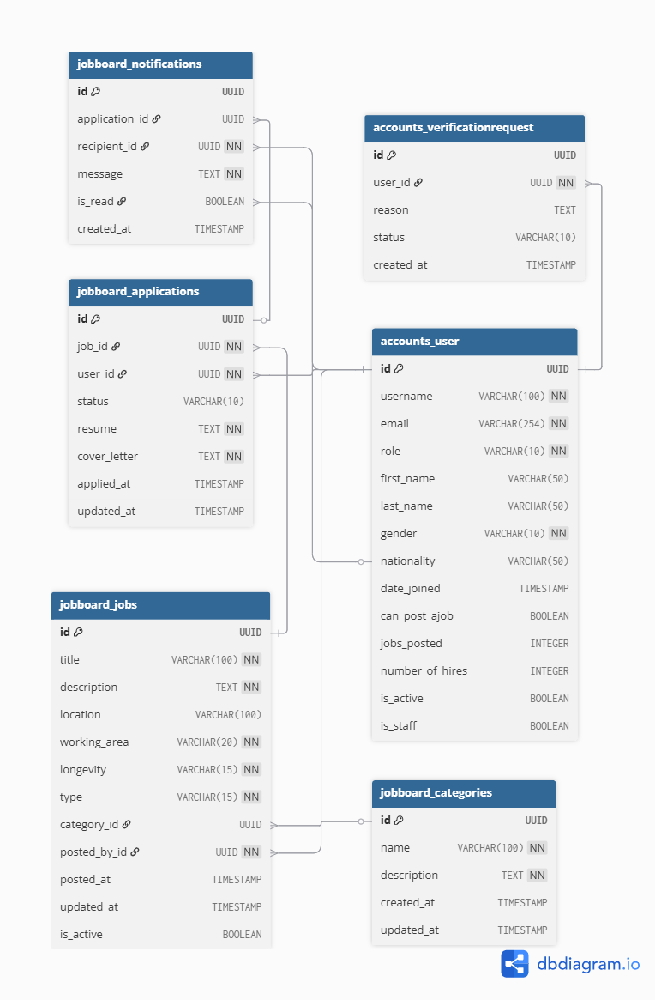

# Jobboard Project – Database Schema

## Users
- **id:** UUID, Primary Key  
- **username:** VARCHAR(100), unique, not null  
- **email:** VARCHAR(254), unique, not null  
- **role:** VARCHAR(10), not null (admin / user)  
- **first_name:** VARCHAR(50), optional  
- **last_name:** VARCHAR(50), optional  
- **gender:** VARCHAR(10), not null (male / female)  
- **nationality:** VARCHAR(50), optional  
- **date_joined:** TIMESTAMP WITH TIME ZONE, default current timestamp  
- **can_post_ajob:** BOOLEAN, default false  
- **jobs_posted:** INTEGER, default 0  
- **number_of_hires:** INTEGER, default 0  
- **is_active:** BOOLEAN, default true  
- **is_staff:** BOOLEAN, default false  

**Relationships:**  
- 1-to-many with `verification_requests`  
- 1-to-many with `jobs` (posted_by)  
- 1-to-many with `applications` (applicant)  
- 1-to-many with `notifications` (recipient)

---

## VerificationRequests
- **id:** UUID, Primary Key, default `uuid_generate_v4()`  
- **user_id:** UUID, Foreign Key → `users.id`, on delete cascade  
- **reason:** TEXT, optional  
- **status:** VARCHAR(10), default `pending` (pending / approved / denied)  
- **created_at:** TIMESTAMP WITH TIME ZONE, default current timestamp  

**Relationships:**  
- Many-to-1 with `users`

---

## Categories
- **id:** UUID, Primary Key, default `uuid_generate_v4()`  
- **name:** VARCHAR(100), unique, not null  
- **description:** TEXT, not null  
- **created_at:** TIMESTAMP WITH TIME ZONE, default current timestamp  
- **updated_at:** TIMESTAMP WITH TIME ZONE, default current timestamp  

**Relationships:**  
- 1-to-many with `jobs`

---

## Jobs
- **id:** UUID, Primary Key, default `uuid_generate_v4()`  
- **title:** VARCHAR(100), not null  
- **description:** TEXT, not null  
- **location:** VARCHAR(100)  
- **working_area:** VARCHAR(20), not null (onsite / remote / hybrid)  
- **longevity:** VARCHAR(15), not null (contractual / permanent)  
- **type:** VARCHAR(15), not null (full-time / part-time)  
- **category_id:** UUID, Foreign Key → `categories.id`, on delete set null  
- **posted_by_id:** UUID, Foreign Key → `users.id`, on delete cascade  
- **posted_at:** TIMESTAMP WITH TIME ZONE, default current timestamp  
- **updated_at:** TIMESTAMP WITH TIME ZONE, default current timestamp  
- **is_active:** BOOLEAN, default true  

**Relationships:**  
- Many-to-1 with `users` (posted_by)  
- Many-to-1 with `categories`  
- 1-to-many with `applications`

---

## Applications
- **id:** UUID, Primary Key, default `uuid_generate_v4()`  
- **job_id:** UUID, Foreign Key → `jobs.id`, on delete cascade  
- **user_id:** UUID, Foreign Key → `users.id`, on delete cascade  
- **status:** VARCHAR(10), default `pending` (pending / accepted / rejected)  
- **resume:** TEXT, not null  
- **cover_letter:** TEXT, not null  
- **applied_at:** TIMESTAMP WITH TIME ZONE, default current timestamp  
- **updated_at:** TIMESTAMP WITH TIME ZONE, default current timestamp  

**Relationships:**  
- Many-to-1 with `jobs`  
- Many-to-1 with `users` (applicant)  
- 1-to-many with `notifications`

---

## Notifications
- **id:** UUID, Primary Key, default `uuid_generate_v4()`  
- **application_id:** UUID, Foreign Key → `applications.id`, on delete cascade, optional  
- **recipient_id:** UUID, Foreign Key → `users.id`, on delete cascade  
- **message:** TEXT, not null  
- **is_read:** BOOLEAN, default false  
- **created_at:** TIMESTAMP WITH TIME ZONE, default current timestamp  

**Relationships:**  
- Many-to-1 with `applications` (optional)  
- Many-to-1 with `users` (recipient)

---

## ER Diagram
**Interactive**:
[View ER Diagram](https://dbdiagram.io/d/68c9a1071ff9c616bdfae254)

